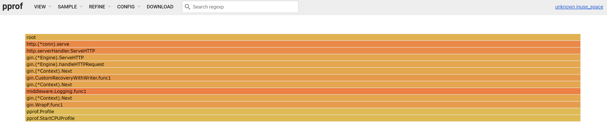
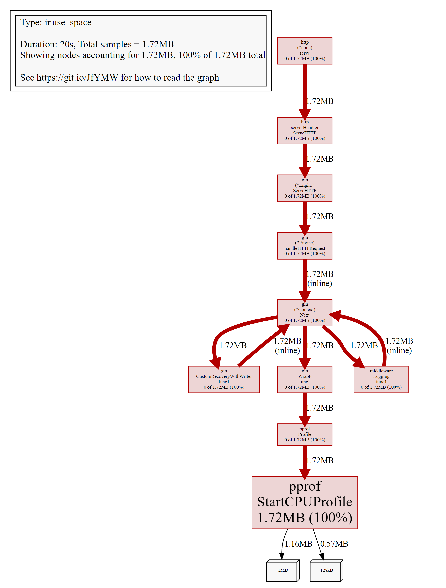
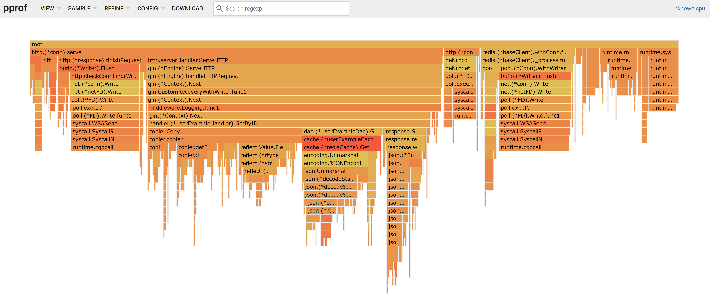
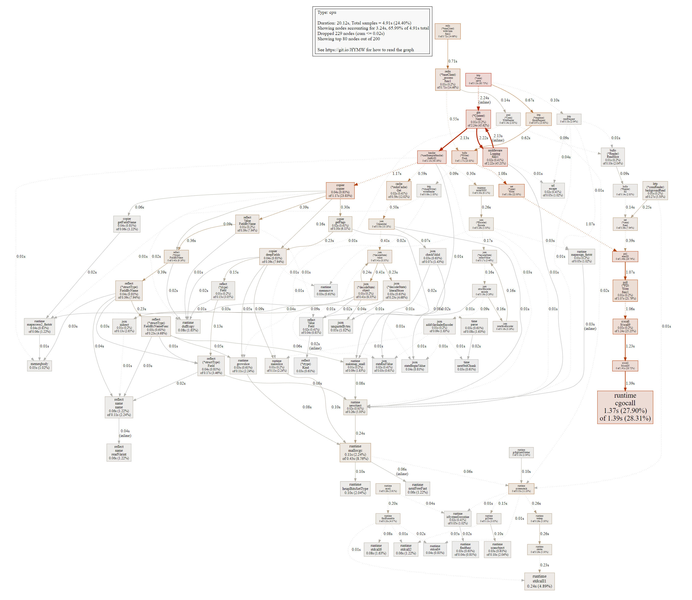
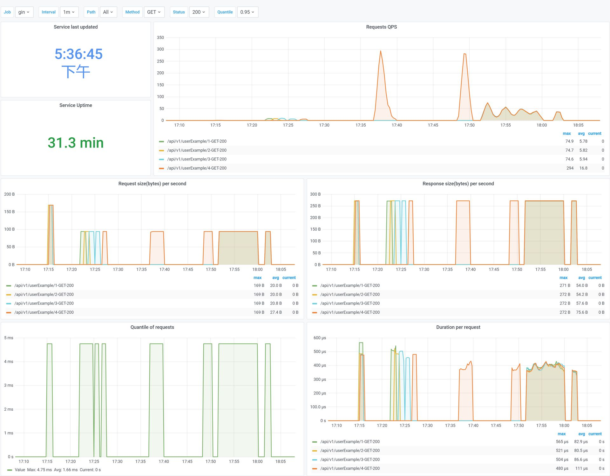

## projectExample

一个web服务demo。

<br>

### 目录结构

```
├── cmd                          # 脚手架目录，例如分布式任务
├── config                       # 配置文件目录
├── docs                         # 项目文档目录
├── internal                     # 业务目录
│   ├── cache                   # 基于业务封装的cache
│   ├── dao                      # 数据访问层
│   ├── handler                # http 接口
│   ├── errcode                # 业务自定义错误码
│   ├── model                  # 数据库 model
│   ├── routers                 # 业务路由
│   └── types                   # 定义一些公共类型
├── logs                          # 存放日志的目录
├── pkg                          # 公共 package 目录
├── scripts                      # 存放用于执行各种构建，安装，分析等操作的脚本
└── main.go                    # 项目入口文件
```

<br>

### 技术栈

- 框架路由和中间件 [gin](https://github.com/gin-gonic/gin)
- 配置文件解析 [viper](https://github.com/spf13/viper)
- 校验器 [validator](github.com/go-playground/validator)
- 日志 [zap](go.uber.org/zap)
- 数据库组件 [gorm](gorm.io/gorm)
- 缓存组件 [go-redis](github.com/go-redis/redis)
- 生成文档 [swagger](github.com/swaggo/swag)
- 链路跟踪 [opentelemetry](go.opentelemetry.io/otel)
- 指标采集 [prometheus](github.com/prometheus/client_golang/prometheus)
- 限流 [ratelimiter](golang.org/x/time/rate)
- 包管理工具 [go modules](https://github.com/golang/go/wiki/Modules)
- 性能分析 [go profile](https://go.dev/blog/pprof)
- 代码检测 [golangci-lint](https://github.com/golangci/golangci-lint)

<br>

### 运行

根据配置文件设置是否开启服务治理功能，例如链路跟踪、指标采集、限流、性能分析。

启动web服务

> run.sh

在浏览器打开 `http://ip:port/swagger/index.html` 可以看到接口文档，可以把swagger的json文档导入 [yapi](https://github.com/YMFE/yapi) 测试。

注：每次更新都要执行swag init，并且重启服务生效。

<br>

### 性能分析

#### 压测

打开配置文件，开启profle功能，关闭所有服务治理情况下，执行下面压测代码，一共4个goroutine，持续1分钟执行urls的GET请求，返回统计信息 `time=60.002s,  success=173056, failure=0, successRate=100.0%, qps=2884.2`。

```go
package main

import (
	"context"
	"errors"
	"fmt"
	"io"
	"net/http"
	"sync"
	"sync/atomic"
	"time"
)

func main() {
	g := 4
	urls := []string{
		"http://localhost:8080/api/v1/userExample/1",
		"http://localhost:8080/api/v1/userExample/2",
		"http://localhost:8080/api/v1/userExample/3",
		"http://localhost:8080/api/v1/userExample/4",
	}
	t := time.Minute

	fmt.Println(PressureGet(g, urls, t))
}

// PressureGet 压测GET，g:goroutine数量，urls:请求url，duration:压测时长
func PressureGet(g int, urls []string, duration time.Duration) string {
	var (
		success int32 = 0
		failure int32 = 0
		start         = time.Now()
		ctx, _        = context.WithTimeout(context.Background(), duration)
	)

	wg := &sync.WaitGroup{}
	for i := 0; i < g; i++ {
		wg.Add(1)

		go func() {
			defer wg.Done()
			for {
				select {
				case <-ctx.Done():
					return
				default:
					for _, url := range urls {
						err := get(url)
						if err != nil {
							atomic.AddInt32(&failure, 1)
						} else {
							atomic.AddInt32(&success, 1)
						}
					}
				}
			}
		}()
	}

	wg.Wait()
	time := time.Now().Sub(start).Seconds()
	total := float32(success + failure)
	return fmt.Sprintf("time=%.3fs,  success=%d, failure=%d, successRate=%.1f%%, qps=%.1f", time, success, failure, float32(success*100)/total, float64(success)/time)
}

func get(url string) error {
	resp, err := http.Get(url)
	if err != nil {
		return err
	}
	defer resp.Body.Close()

	_, err = io.ReadAll(resp.Body)
	if err != nil {
		return err
	}
	if resp.StatusCode != http.StatusOK {
		return errors.New(http.StatusText(resp.StatusCode))
	}

	return nil
}
```
<br>

#### 在压测过程中内存统计

> go tool pprof -http=:7778 -seconds=20 http://localhost:8080/debug/pprof/heap

<br>




<br>

#### 在压测过程中CPU统计

> go tool pprof -http=:7779 -seconds=20 http://localhost:8080/debug/pprof/profile




<br>

#### 指标



<br>
